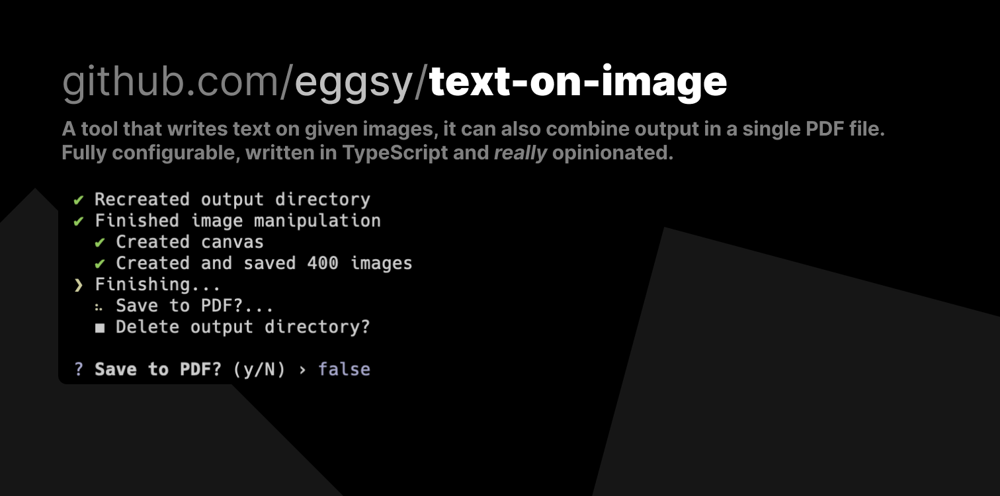

# Text onn Image

  

A simple tool that writes text on any image based on X and Y coordinates, it can also combine images into one single PDF file.

## The Story

We had to find a way to create tens of tickets for our theater play at the university. We thought writing by hand would take so much time and I decided to create an app for it.

This app was very basic at first, but I polished it to publish it on GitHub.

## License

[MIT](https://github.com/eggsy/text-on-image/blob/main/LICENSE) License © 2022 [Abdulbaki "EGGSY" Dursun](https://github.com/eggsy)
